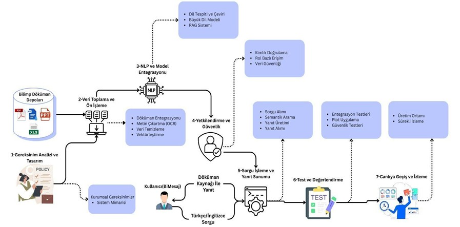

# Uçtan Uca İş Akışı Rehberi

## Genel Bakış
Bu rehber, "Büyük Dil Modeli Temelli Kurumsal Döküman Danışmanı" projesinin, veri alımından kullanıcıya yanıt sunumuna kadar olan tüm süreçlerini adım adım açıklamaktadır. Sistem, temel olarak **RAG (Retrieval-Augmented Generation)** mimarisine dayanır ve kurumsal dokümanlar üzerinde akıllı bir sorgulama katmanı oluşturur. Bu doküman, sistemin nasıl çalıştığını ve bileşenlerin birbiriyle nasıl etkileşimde bulunduğunu detaylandırır.

## Sistem Mimarisi ve İş Akışı Diyagramı
Aşağıdaki diyagram, projenin 7 ana adımdan oluşan uçtan uca iş akışını görselleştirmektedir.

## Adım Adım İş Akışı Detayları

Aşağıda diyagramda gösterilen her bir adımın detaylı açıklaması yer almaktadır.

### Adım 1: Gereksinim Analizi ve Tasarım
- **Aktivite:** Projenin hedefleri, kapsamı ve fonksiyonel/non-fonksiyonel gereksinimleri belirlenir.
- **Çıktı:** Sistem mimarisi, kullanılacak teknolojiler (LLM, vektör veritabanı vb.) ve modül tasarımlarını içeren "Sistem Tasarım ve Gereksinim Dokümanı" oluşturulur.

### Adım 2: Veri Toplama ve Ön İşleme (Data Ingestion & Pre-processing)
Bu aşama, `Veri İşleme Servisi` tarafından asenkron olarak yürütülür.
- **Veri Kaynakları:** Bilimp Döküman Depoları'nda bulunan `PDF`, `DOCX`, `XLSX`, `PPTX` formatındaki kurumsal belgeler toplanır.
- **Metin Çıkarma (Parsing & OCR):** Belgelerden metin, tablo ve diğer içerikler çıkarılır. Görsel tabanlı dokümanlar için Optik Karakter Tanıma (OCR) uygulanır.
- **Parçalama (Chunking):** Uzun dokümanlar, anlamsal bütünlüğü korunarak daha küçük ve yönetilebilir metin parçalarına (chunk) ayrılır.
- **Vektörleştirme (Embedding):** Her metin parçası, `multilingual-e5-large` veya `BGE-M3` gibi bir embedding modeli kullanılarak anlamsal bir vektöre dönüştürülür.
- **İndeksleme:** Oluşturulan vektörler, yetki bilgilerini içeren RBAC metadatası (`access_control_metadata`) ile birlikte **Qdrant** vektör veritabanına kaydedilir.

### Adım 3: NLP ve Model Entegrasyonu
- **Aktivite:** Sistemin zeka katmanını oluşturan dil modelleri ve RAG mantığı entegre edilir.
- **Bileşenler:**
    - **Dil Tespiti ve Çeviri:** Çok dilli sorguları yönetmek için kullanılır.
    - **Büyük Dil Modeli (LLM - Reader):** `Llama 3`, `Qwen2` gibi modeller, bağlamı anlayıp insan dilinde yanıt üretir.
    - **RAG Sistemi:** `LangChain` veya `LlamaIndex` gibi çerçevelerle retrieval, reranking ve generation adımlarını yöneten orkestrasyonu sağlar.

### Adım 4: Yetkilendirme ve Güvenlik (Authorization & Security)
- **Aktivite:** Kullanıcıların yalnızca yetkileri dahilindeki bilgilere erişmesini garanti altına alan güvenlik katmanıdır.
- **Süreç:**
    - **Kimlik Doğrulama:** Kullanıcı, Bilimp platformu üzerinden JWT (JSON Web Token) ile doğrulanır.
    - **Rol Bazlı Erişim Kontrolü (RBAC):** Kullanıcının rol ve departman bilgileri alınır.
    - **Veri Güvenliği:** Vektör veritabanında yapılan aramalarda, bu rol ve departman bilgileri filtre olarak kullanılır, böylece sadece izin verilen `chunk`'lar geri döndürülür.

### Adım 5: Sorgu İşleme ve Yanıt Sunumu (Query Processing & Response)
`API Servisi` ve `Orkestrasyon Servisi` tarafından yönetilen bu akış, kullanıcı sorgusuna yanıt verme sürecidir.
1.  **Sorgu Alımı:** Kullanıcı, Bilimp arayüzü üzerinden Türkçe veya İngilizce doğal dil sorgusunu gönderir.
2.  **Semantik Arama (Retrieval):** Kullanıcının sorgusu vektöre dönüştürülür ve Qdrant veritabanında (RBAC filtreleri uygulanarak) anlamsal olarak en yakın doküman parçaları (`context`) bulunur.
3.  **Yanıt Üretimi (Generation):** Bulunan bağlam ve kullanıcının orijinal sorusu, bir prompt şablonu içinde birleştirilerek LLM'e gönderilir. LLM, bu bilgilere dayanarak bir yanıt üretir.
4.  **Yanıt Sunumu:** Üretilen yanıt, kaynağı olan doküman bilgisiyle birlikte kullanıcıya sunulur.

### Adım 6: Test ve Değerlendirme
- **Aktivite:** Sistemin doğruluğunu, performansını ve güvenliğini sağlamak için yapılan testlerdir.
- **Test Türleri:**
    - **Entegrasyon Testleri:** Mikroservislerin (API, Veri İşleme, Orkestrasyon) birlikte uyumlu çalışıp çalışmadığı test edilir.
    - **Pilot Uygulama ve Değerlendirme:** `RAGAS` gibi çerçeveler kullanılarak yanıtların doğruluğu (faithfulness) ve kaynakla uyumu (relevancy) nicel olarak ölçülür.
    - **Güvenlik Testleri:** Yetkilendirme mekanizmasının doğru çalıştığı ve veri sızıntısı olmadığı doğrulanır.

### Adım 7: Canlıya Geçiş ve İzleme (Deployment & Monitoring)
- **Aktivite:** Testleri başarıyla geçen sistemin üretim ortamına dağıtılması ve sürekli olarak izlenmesidir.
- **Süreç:**
    - **Üretim Ortamı:** Sistem, on-premise veya özel bulut altyapısında canlıya alınır.
    - **Sürekli İzleme:** Sistemin performansı (yanıt süreleri, kaynak kullanımı), hata oranları ve kullanıcı etkileşimleri sürekli olarak izlenir ve olası sorunlara proaktif olarak müdahale edilir.
